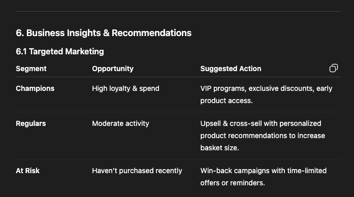
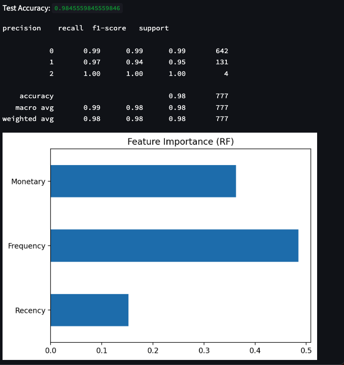

README

Customer Segmentation & Anomaly Detection Report

Live Demo – http://172.20.10.2:8501/

Project Overview – 
The goal was to segment UK-based customers of an online retail company to:
    Identify distinct purchasing patterns for targeted marketing.
    Highlight high-value customers and dormant accounts.
    Detect anomalous transactions that may represent fraud or data errors.
    A full interactive Streamlit dashboard was built to allow stakeholders 
    to upload raw Excel data, run segmentation, and visualize the results.

Setup-

git clone https://github.com/your-username/customer-segmentation.git

cd customer-segmentation

pip install -r requirements.txt

streamlit run src/app.py

Repository Structure 

customer-segmentation/

│

├─ src/   

│   ├─ data_utils.py

│   ├─ rfm_analysis.py

│   ├─ tree_models.py

│   ├─ anomaly.py

│   └─ app.py

│
├─ Images

│   ├─ dashbord_image.png

│   └─ feature_importances.png

├─ data/

│   └─ sample_online_retail.xlsx

├─ notebooks/

│   └─ exploratory_analysis.ipynb 

├─ reports/

│   └─ project_report.md

│

├─ requirements.txt

