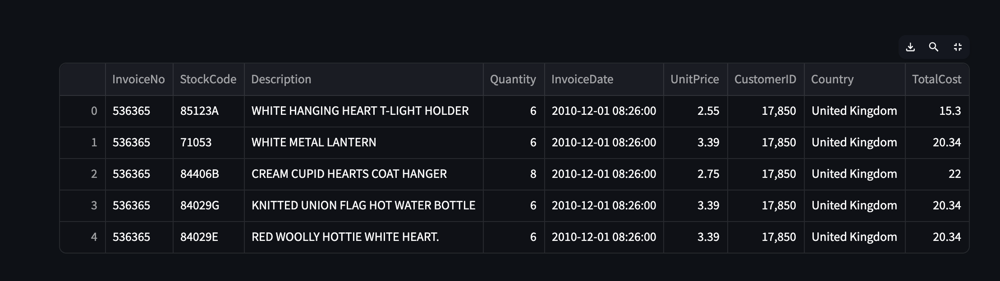

**Customer Segmentation & Anomaly Detection Report**

**Prepared by:** IKililou Akandji

**Project Type:** Unsupervised Customer Segmentation, Cluster Interpretation, and Outlier Detection

Tools & Libraries: Python, Pandas, Scikit-Learn, Plotly, Matplotlib, Seaborn, Streamlit

**1. Project Overview**
The goal was to segment UK-based customers of an online retail company to:
Identify distinct purchasing patterns for targeted marketing.

Highlight high-value customers and dormant accounts.

Detect anomalous transactions that may represent fraud or data errors.

A full interactive Streamlit dashboard was built so stakeholders can upload raw Excel data, run segmentation, and visualize the results.

**2. Data Pipeline**
Input: online_retail.xlsx
Data Cleaning (data_utils.py):
Removed cancellations (InvoiceNo starting with “C”).

Filtered to United Kingdom transactions only.

Calculated TotalCost = Quantity × UnitPrice.

Removed extreme outliers (TotalCost ≤ £500, Quantity ≤ 100), leaving us with 98% of UK customers.

RFM Table Creation:
Recency – Days since the customer’s last purchase.

Frequency – Number of unique invoices per customer.

Monetary – Total spend in GBP per customer.

The resulting RFM dataset contains one row per customer, forming the basis for clustering.

**3. Clustering Analysis (rfm_analysis.py)**
Methodology
Features standardized using StandardScaler.

K-Means tested for k = 2–10.

Silhouette score and Inertia (Elbow Method) guided the optimal k.

Findings
Optimal clusters: k = 3

PCA (2 components) clearly separated three groups.

Cluster IDs (labels_) served as pseudo-labels for supervised interpretation.

**4. Cluster Interpretation (tree_models.py)**
A Random Forest Classifier achieved strong predictive accuracy on the pseudo-labels.

Feature importance scores:

Frequency ≈ 0.48 – Primary driver

Monetary ≈ 0.36 – Secondary driver

Recency ≈ 0.15 – Tertiary driver

This shows that how often customers buy is the strongest signal when distinguishing clusters. 
Spending level is next most important, while time since last purchase has the least influence.

| Cluster    | Recency (days)     | Frequency          | Monetary         | Customer Type
|:-----------|:-------------------|:-------------------|------------------|-----------------------------------------|
| 0          | Low                | High               | High             | “Champions” – loyal, frequent, high-spend customers
| 1          | High               | Low                | Low              | “At Risk” – long time since last purchase
| 2          | Medium             | Medium             | Medium           | “Regulars” – steady customers

**5. Anomaly Detection (anomaly.py)**
Isolation Forest (2 % contamination) flagged unusual RFM profiles.

Outliers visualized on a frequency_monetary scatter plot include:

Outliers visualized on a recency–Monetary scatter plot include:

Outliers visualized on a recency–frequency scatter plot include:

**6. Business Insights & Recommendations**
6.1 Targeted Marketing

| Segment     | Opportunity                            | Suggested Action                                           |
|:------------|:---------------------------------------|:-----------------------------------------------------------|
| Champions   | High loyalty and spend                 | VIP Programs: exclusive discounts, early product access    |
| Regulars    | Moderate activity                      | Upsell & Cross-sell: personalized product recommendations  |
| At Risk     | Haven’t purchased recently             | Win-back Campaigns: limited-time offers or reminders       |

6.2 Inventory & Operations
Clusters guide demand forecasting—Champions inform stock prioritization for high-margin products.

6.3 Risk & Fraud Management
Review Isolation-Forest outliers: validate billing/shipping details and flag extreme transactions for manual checks.

7. **Deliverables**
Modular Python package:

data_utils.py – Data cleaning & RFM creation

rfm_analysis.py – Clustering & visualizations

tree_models.py – Supervised interpretation

anomaly.py – Outlier detection

app.py – Streamlit dashboard for end-to-end analysis

Interactive Dashboard Workflow:
Upload Excel → View Cleaned Data → RFM Table → Optimal Cluster Charts → Feature Importance → Anomaly Scatter Plots.

**Executive Summary:**
Through RFM segmentation and machine learning, I uncovered three clear customer segments and identified outlier behaviors.
Purchase Frequency emerged as the strongest determinant of customer value, followed by total spend (Monetary), with Recency playing a smaller but still meaningful role.
To increase revenue and retention, the company should prioritize strategies that drive repeat purchases—loyalty programs, personalized recommendations, and subscription offerings—while also leveraging Monetary and Recency cues for refined marketing and risk management.
